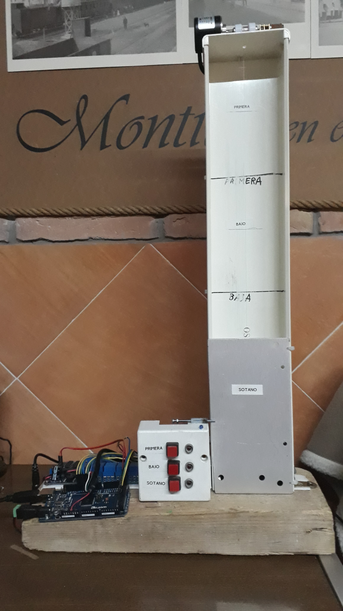
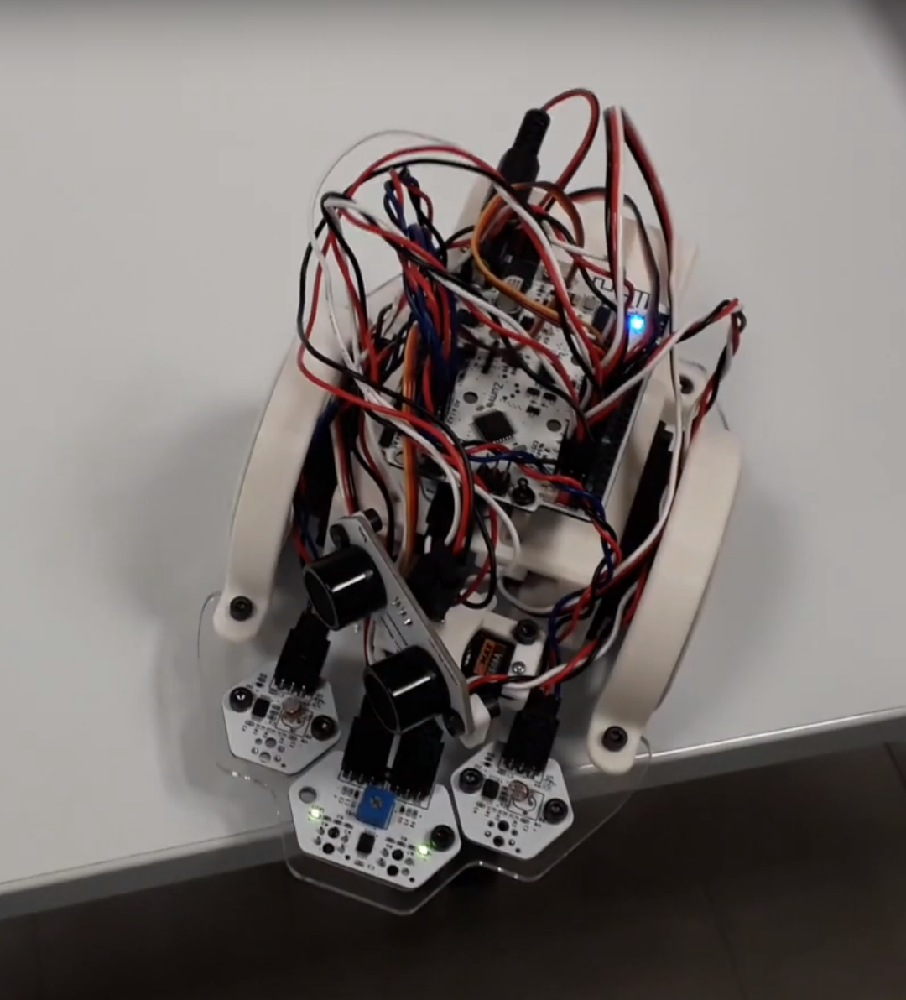

# arduino-projects
Several projects using Arduino

## Ascensor

Controlador para un ascensor de 3 plantas con módulos claramente diferenciables para que cualquiera con pocas nociones de programación pueda entender el código.

## Robovac

Autonomous robot controller to detect obstacles and avoid falls.

[https://www.youtube.com/watch?v=gyLSTWR13Qc](https://www.youtube.com/watch?v=gyLSTWR13Qc)

